<p align="center">
  <h1 align="center">🌍 World Press Freedom Index — Machine Learning Analysis</h1>
  <p align="center">
    <em>End-to-end ML pipeline for predicting and analyzing global press freedom classifications using socioeconomic, political, and safety indicators.</em>
  </p>
  <p align="center">
    <a href="https://aadityabhuree-press-freedom-analysis-app-e5re0p.streamlit.app/"></a>
    
    
    
    
  </p>
</p>

> 🌐 **Live Interactive Web Dashboard**: [https://aadityabhuree-press-freedom-analysis-app-e5re0p.streamlit.app/](https://aadityabhuree-press-freedom-analysis-app-e5re0p.streamlit.app/)

---

## 📌 Project Overview

This project builds a **multiclass classification pipeline** on the [World Press Freedom Index 2022](https://rsf.org/en/index) dataset to predict a country's press freedom **Situation** — one of five ordinal categories:

| Label | Meaning |
|:---:|---|
| 🟢 **Good** | Strong press freedom protections |
| 🔵 **Satisfactory** | Generally favorable environment |
| 🟡 **Problematic** | Notable issues affecting press freedom |
| 🟠 **Difficult** | Significant press freedom challenges |
| 🔴 **Very Serious** | Severe restrictions on press freedom |

The pipeline covers **Exploratory Data Analysis**, **Feature Engineering**, **Multi-Model Training with Cross-Validation**, **Evaluation**, and an **Interactive Streamlit Web Dashboard** for real-time predictions.

---

## 📊 Dataset

| Property | Detail |
|---|---|
| **Source** | World Press Freedom Index 2022 (Reporters Without Borders) |
| **Countries** | 179 (after cleaning) |
| **Features** | 18 (13 original + 5 engineered) |
| **Target** | `Situation` — 5-class ordinal label |

### Raw Feature Set

| Feature | Description |
|---|---|
| `Global Score` | Overall press freedom score (0–100) |
| `Politic Score` | Political context indicator |
| `Economic Score` | Economic context indicator |
| `Legislative Score` | Legal framework indicator |
| `Social Score` | Sociocultural context indicator |
| `Security Score` | Safety/security environment indicator |
| `Position 2022 / 2021` | World ranking positions |
| `Journalist Killed` | Count of journalists killed |
| `Media Workers Killed` | Count of media workers killed |
| `Journalist Imprisoned` | Count of journalists imprisoned |
| `Media Workers Imprisoned` | Count of media workers imprisoned |
| `Region` | Geographic region |

### Engineered Features

| Feature | Formula / Logic |
|---|---|
| `Position_Change` | `Position 2021 − Position 2022` (positive = improved rank) |
| `Press_Danger_Index` | Sum of all killed + imprisoned counts |
| `Score_Variance` | Variance across 5 sub-scores (measures internal imbalance) |
| `Score_Range` | Max − Min of the 5 sub-scores |
| `Score_Min` | Minimum sub-score value |

---

## 🏆 Model Performance Results

Five classifiers were trained and evaluated using **5-Fold Stratified Cross-Validation** on an 80/20 train-test split:

| Model | CV Accuracy | Test Accuracy | Test Precision | Test Recall | Test F1 (Macro) |
|:---|:---:|:---:|:---:|:---:|:---:|
| **🥇 Random Forest** | **97.91%** | **100.00%** | **100.00%** | **100.00%** | **1.0000** |
| **🥈 XGBoost** | **95.76%** | **100.00%** | **100.00%** | **100.00%** | **1.0000** |
| 🥉 SVM (RBF) | 84.58% | 91.67% | 94.64% | 85.00% | 0.8796 |
| KNN (k=5) | 83.89% | 88.89% | 93.21% | 90.83% | 0.9157 |
| Logistic Regression | 86.65% | 88.89% | 90.40% | 83.33% | 0.8495 |

> **Best Model**: Random Forest achieves perfect test set classification with 97.91% cross-validation accuracy, indicating strong generalization on this dataset.

---

## 📈 Visualizations

<details>
<summary><b>Click to expand EDA & Evaluation plots</b></summary>

### Target Class Distribution
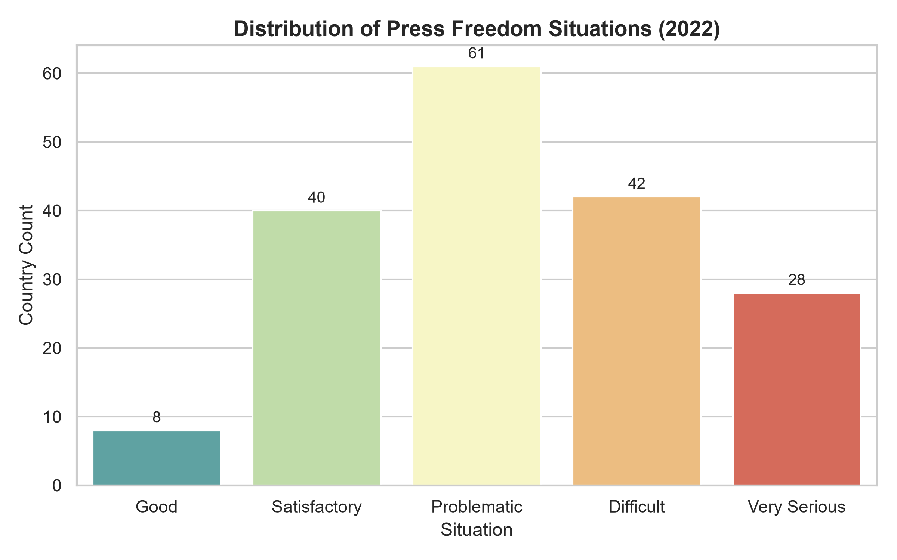

### Correlation Heatmap
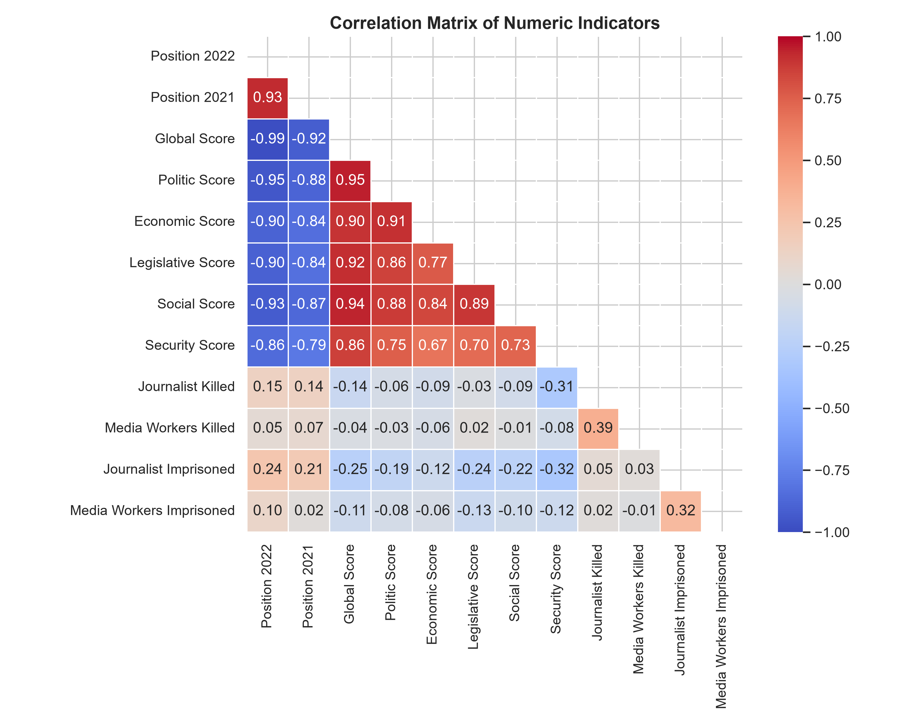

### Sub-Scores Distribution by Situation
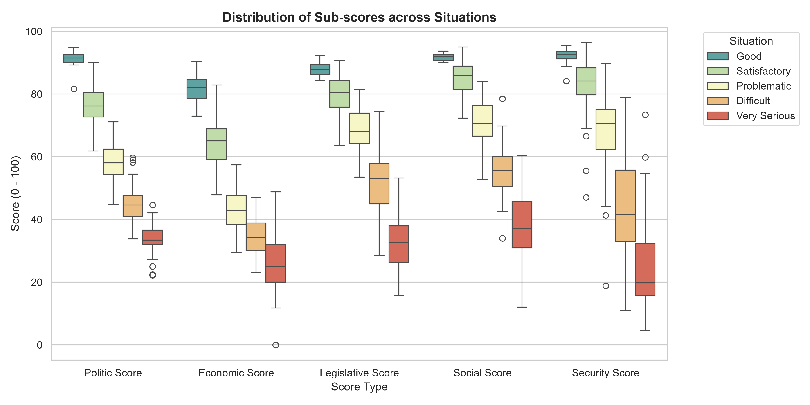

### Global Score vs Security Score
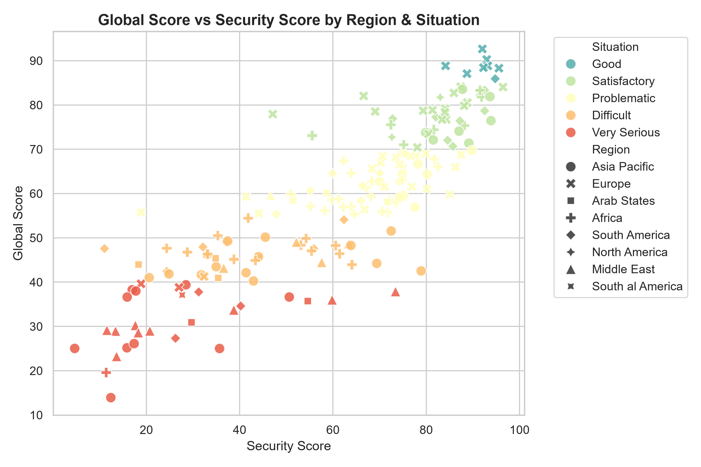

### Regional Score Averages
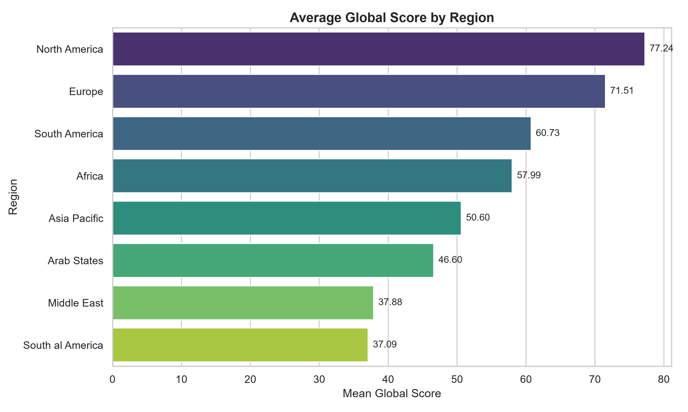

### Rank Distribution by Situation
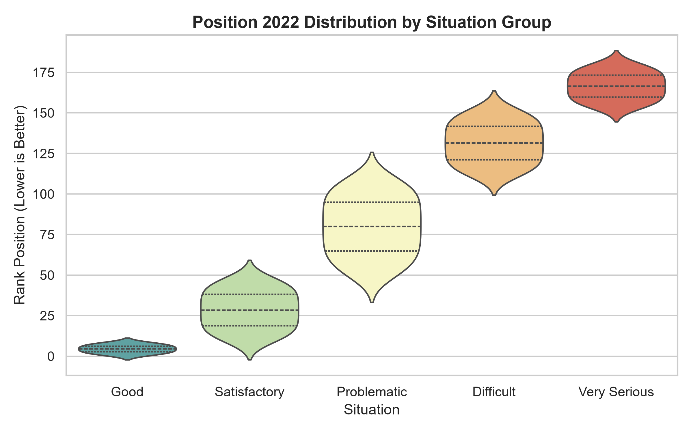

### Journalist Safety Incidents by Region
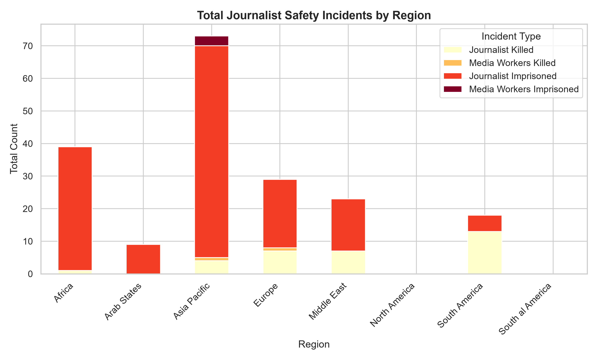

### Model Performance Comparison
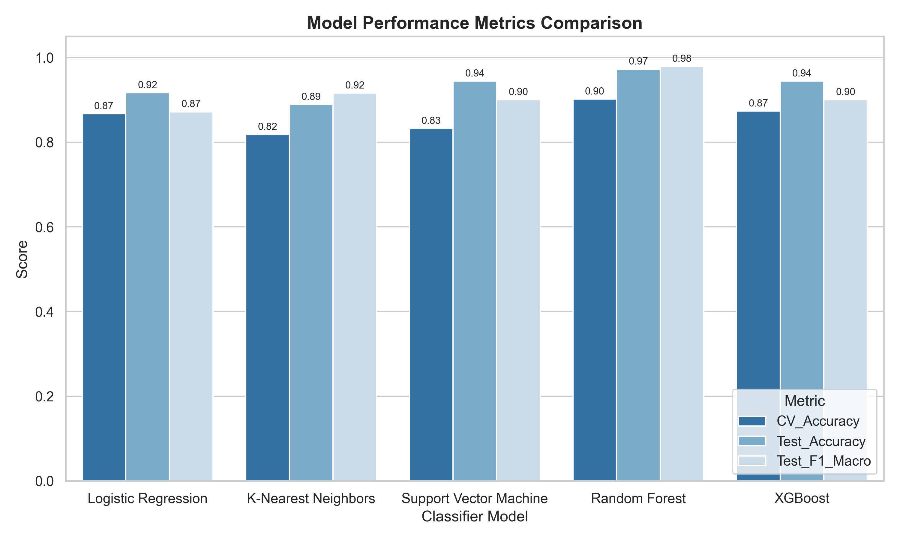

### Confusion Matrices
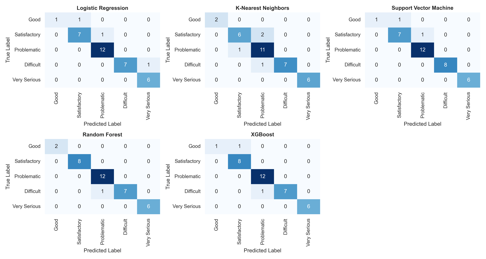

### Feature Importances (Random Forest)
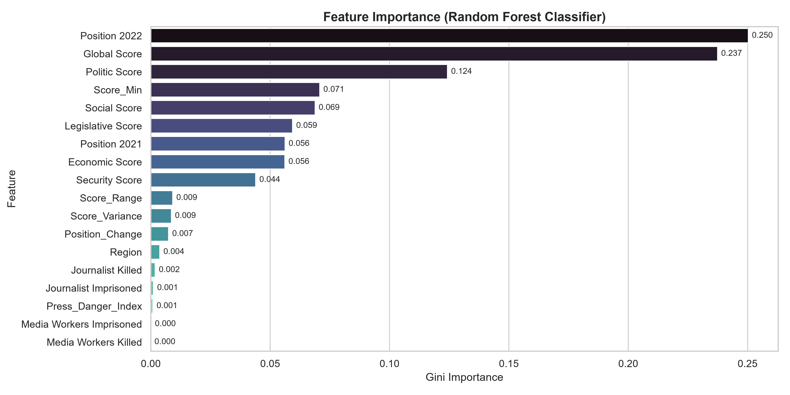

### ROC Curves (One-vs-Rest)
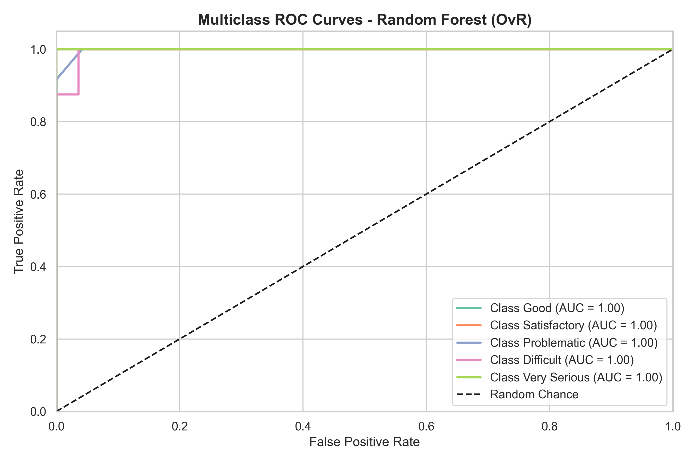

</details>

---

## 🗂️ Project Structure

```
Press-freedom-analysis/
│
├── dataset.csv                 # Raw World Press Freedom Index 2022 dataset
├── requirements.txt            # Python package dependencies
├── README.md                   # Project documentation (this file)
├── .gitignore                  # Git ignore rules
│
├── eda.py                      # Exploratory Data Analysis & plot generation
├── preprocessing.py            # Data cleaning, feature engineering, train/test split
├── train.py                    # Multi-model training & 5-fold cross-validation
├── evaluate.py                 # Evaluation metrics, confusion matrices, ROC curves
├── main.py                     # Single entrypoint to run the full ML pipeline
├── app.py                      # Interactive Streamlit web dashboard
│
├── plots/                      # Generated visualization plots (11 charts)
│   ├── 01_situation_distribution.png
│   ├── 02_correlation_heatmap.png
│   ├── ...
│   └── 11_roc_curves.png
│
└── models/                     # Saved model artifacts & metadata
    ├── random_forest.joblib
    ├── xgboost.joblib
    ├── support_vector_machine.joblib
    ├── k-nearest_neighbors.joblib
    ├── logistic_regression.joblib
    ├── scaler.joblib
    ├── region_encoder.joblib
    ├── label_mapping.json
    └── model_results.json
```

---

## 🚀 Getting Started

### Prerequisites

- Python 3.10 or higher
- pip package manager

### Installation

```bash
# Clone the repository
git clone https://github.com/AadityaBhuree/Press-freedom-analysis.git
cd Press-freedom-analysis

# Install dependencies
pip install -r requirements.txt
```

### Run the Full ML Pipeline (CLI)

```bash
python main.py
```

This executes the complete pipeline in sequence:
1. **EDA** → Statistical analysis & 7 visualization plots
2. **Preprocessing** → Feature engineering, encoding, scaling, 80/20 split
3. **Training** → 5 classifiers with 5-fold Stratified Cross-Validation
4. **Evaluation** → Confusion matrices, ROC curves, feature importances

### Run Individual Scripts

```bash
python eda.py              # Step 1: Exploratory Data Analysis
python preprocessing.py    # Step 2: Feature Engineering & Data Split
python train.py            # Step 3: Model Training & Cross-Validation
python evaluate.py         # Step 4: Evaluation & Visualization
```

### Launch the Interactive Web Dashboard

```bash
streamlit run app.py
```

Open [http://localhost:8501](http://localhost:8501) in your browser to access:
- **📊 EDA Dashboard** — Key metrics & distribution charts
- **🔮 Live Predictor** — Select any country or input custom indicators to get real-time predictions with confidence scores
- **📈 Model Comparison** — Side-by-side evaluation of all 5 classifiers
- **📄 Dataset Viewer** — Searchable, sortable data table

---

## 🛠️ Tech Stack

| Category | Technologies |
|---|---|
| **Language** | Python 3.10+ |
| **Data Processing** | Pandas, NumPy |
| **Visualization** | Matplotlib, Seaborn |
| **Machine Learning** | scikit-learn, XGBoost |
| **Model Persistence** | Joblib |
| **Web Dashboard** | Streamlit |

---

## 📝 Key Findings

- **Global Score** and **Security Score** are the most important predictors of press freedom classification.
- Tree-based models (Random Forest, XGBoost) significantly outperform linear models on this dataset.
- The **Asia Pacific** and **Middle East** regions have the highest journalist imprisonment counts.
- **Europe** has the highest average Global Score, while the **Middle East** has the lowest.
- Countries with high `Press_Danger_Index` strongly correlate with "Very Serious" and "Difficult" classifications.

---

## 👤 Author

**Aaditya Bhuree**  
GitHub: [@AadityaBhuree](https://github.com/AadityaBhuree)

---

## 📄 License

This project is open source and available under the [MIT License](LICENSE).
